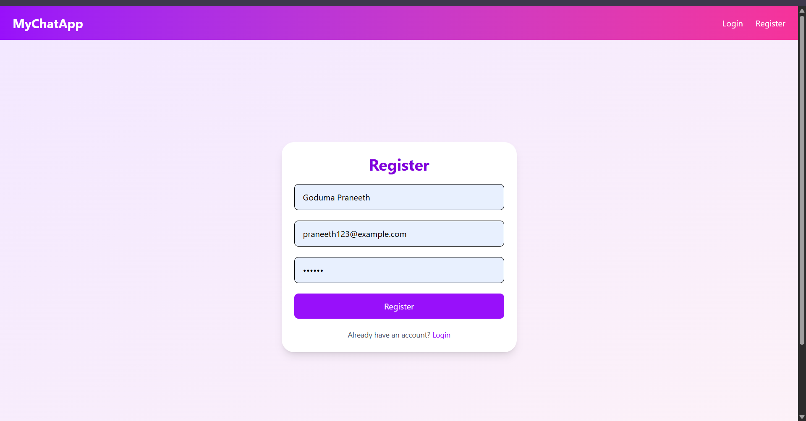
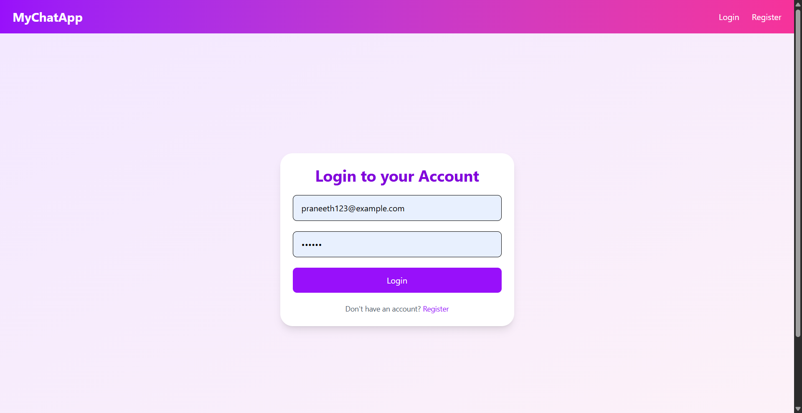
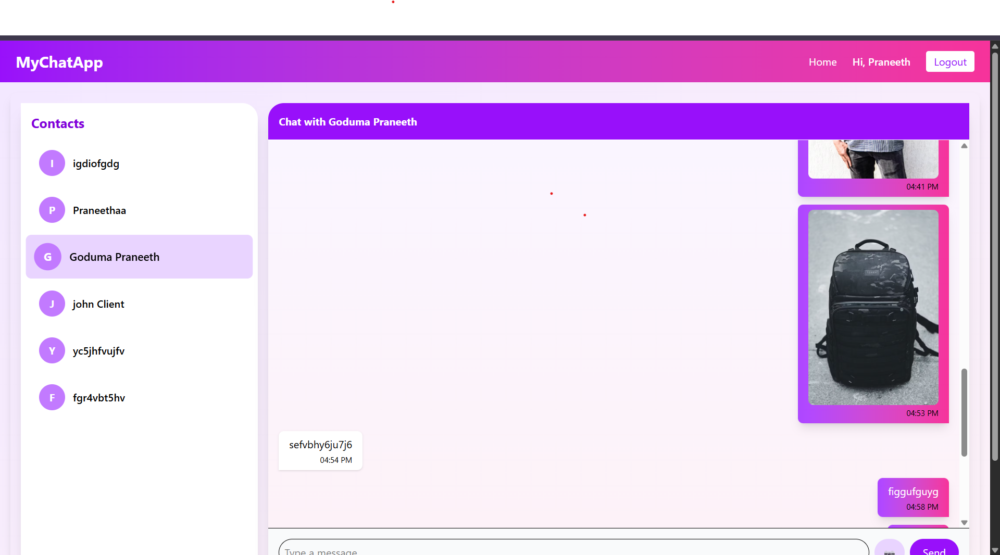

# Chat Application (MERN + Socket.io)

A real-time chat application with authentication, private messaging, and image sharing.

## 🚀 Features
- JWT authentication
- Real-time messaging (Socket.io)
- Private chats
- Image sharing
- Tailwind CSS frontend

## 🛠 Tech Stack
- Frontend: React + Vite + Tailwind
- Backend: Node.js + Express + MongoDB
- Real-time: Socket.io

## 📦 Setup
### Backend

cd backend
npm install
node server.js

 ### Frontend
 
Copy code
cd frontend
npm install
npm run dev

## 📸 Screenshots

### Register Page

### Login Page

### Chat Page

